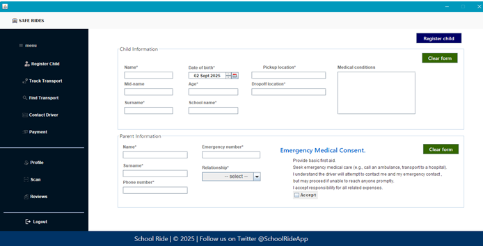
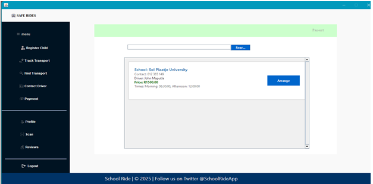
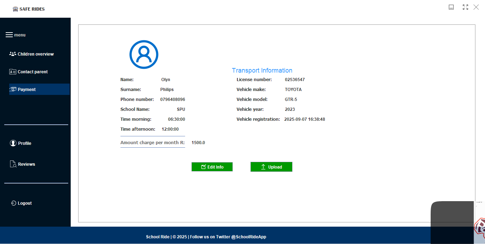

# 🚌 School Transport Management System (STMS)

## 📘 Overview

The **School Transport Management System (STMS)** is a desktop-based solution developed using **Java (NetBeans)** to improve the management, safety, and efficiency of school transportation. It ensures that students are transported safely from home to school and back, while providing transparency and reliability for parents, schools, and transport service providers.

STMS introduces **automated scheduling**, **digital record keeping**, and **real-time communication mechanisms** to modernize traditional school transport operations.

---

## 🎯 Objectives

- Ensure **safe and reliable** transportation for students.  
- Improve **communication** between parents, drivers, and school management.  
- Automate **data entry**, **payment tracking**, and **driver verification**.  
- Enhance **accountability** and **record management** for all stakeholders.  

---

## ⚠️ Problem Identification

### 1. No Parental Communication
Parents are not updated about transport changes or their child’s location, causing misunderstandings and safety concerns.

### 2. No Real-Time Monitoring
Parents and schools cannot track where the transport vehicle is during trips.

### 3. Poor Synchronization and Organization
Transport timing and routes are hard to manage manually, resulting in missed pickups and delays.

### 4. Manual Driver and Student Records
Hardcopy documents get lost or mixed up, making it difficult to manage drivers, learners, and payment data.

### 5. Difficulty Identifying Learners
Drivers often struggle to recognize students, increasing the risk of errors or safety issues.

### 6. Lack of Verification
Drivers and vehicles are sometimes unverified, posing safety risks for students.

---

## 💼 Daily Transactions in School Transport

| Process | Description | Problems Identified |
|----------|--------------|--------------------|
| **Pickup** | Drivers collect learners from home. | No confirmation to parents that students are safely on board. |
| **Drop-offs** | Learners dropped at school or home. | Parents receive no updates on arrival. |
| **Afternoon Return** | Learners picked up from school. | Miscommunication due to schedule changes. |
| **Fee Collection** | Manual cash payments. | Lost records, unpaid balances, and disputes. |
| **Driver Verification** | Drivers hired without verification. | Unsafe and unregulated drivers on duty. |

---

## 🧩 Software Requirements Analysis

The current manual system faces multiple challenges including:
- **Unstructured communication**
- **Lack of tracking and alerts**
- **Poor data management**
- **Slow emergency response**

The **School Transport Management System** automates these processes and offers:
- Centralized student and driver data.
- Digital payment records.
- Verification modules for drivers and vehicles.
- Emergency alert and notification mechanisms.

---

## 💡 Proposed Solutions

### 🛰️ 1. Real-Time Tracking
- Integrate GPS (future feature) to allow location tracking.  
- Send automated alerts for pickups and drop-offs.  

### 🚨 2. Emergency Response Mechanism
- Include an alert feature for accidents or emergencies.  
- Notifications sent automatically to parents and school staff.  

### 💬 3. Parent-Driver Communication
- Built-in system notifications for delays and status updates.  
- Reduce manual calls and miscommunication.  

### 🔐 4. Data Validation & Security
- QR or ID-based learner check-ins.  
- Verified driver and vehicle details stored digitally.  
- Encrypted database connections to prevent tampering.  

---

## 🧠 Expected Outcomes

- Improved **safety** and **accountability** for students.  
- Reduced **manual errors** and **paperwork**.  
- Clear **payment tracking** for parents and transport managers.  
- Increased **parental confidence** through better communication.  

---

## 🏁 Conclusion

The **School Transport Management System (STMS)** addresses the major issues in traditional transport management by integrating automation, digital record-keeping, and reliable communication tools.  
With this system:
- Parents stay informed in real time,  
- Drivers remain accountable,  
- Administrators can track operations efficiently, and  
- Students travel **safely and securely**.

---

## 🧰 Tools & Technologies Used

| Category | Technology |
|-----------|-------------|
| **IDE** | NetBeans |
| **Language** | Java |
| **Database** | MySQL |
| **UI Toolkit** | Java Swing |
| **JDBC Driver** | MySQL Connector/J |
| **Version Control** | GitHub |

---

## 🖼️ System Interface Preview

> You can upload screenshots manually after adding files in your repository.  
> Replace the image paths below with your uploaded images.

### 🏠 Parent registration

### 👩‍🏫 Parent arranget transport

### 🚗 Driver Profile

---

## 🪪 License

This project is open-source and available under the **MIT License**.

---

## 📬 Contact

If you’d like to contribute or report issues, please contact:  
📧 **amantle0628@gmail.com**  
📍 South Africa

---

